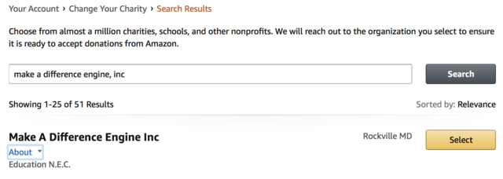

# Donate

For more than four years now, our Coderdojo has been meeting regularly, helping
kids learn and teach each other new skills in computer programming. In that
time we have accomplished so much, and seen the kids who come to our bi-monthly
meetups express their creativity and ingenuity in countless show-and-tell
demonstrations of Scratch projects, Twine games, Raspberry Pi programs and so
much more. Our doors are open to any child who wants to enter and we’ve helped
provide laptops, Raspberry Pi’s and other technology to kids who otherwise
wouldn’t have had access to them.

We do this as volunteers and charge nothing for participation.

## Monetary donations

Like any organization we have expenses like insurance, maintaining our Meetup
website and technology that ages or breaks and needs replacing. If you're in a
position to help, please consider making a tax-deductible donation to our
501(c)3 fiscal sponsor, Make a Difference Engine (EIN: 47-2723442). You can
donate via PayPal donate button below or contact us at dc@coderdojo.com if
you'd prefer to send a check.

<form action="https://www.paypal.com/cgi-bin/webscr" method="post" target="_top">
<input type="hidden" name="cmd" value="_s-xclick">
<input type="hidden" name="hosted_button_id" value="7CUKQGUA5PL24">
<input type="image" src="https://www.paypalobjects.com/en_US/i/btn/btn_donateCC_LG.gif" border="0" name="submit" alt="PayPal - The safer, easier way to pay online!">

</form>

## Amazon Smile

If you shop on Amazon, you can have Amazon automatically donate 0.5%
of what you buy to support CoderDojo DC. To do this, go to
[smile.amazon.com](https://smile.amazon.com) and select Make a Difference
Engine Inc as your charity. Our charity shows up like this on the charity
search page:

For donations to work, be sure to always go to
[smile.amazon.com](https://smile.amazon.com) instead of just amazon.com and
check that Make a Difference Engine is your charity:

## Hardware donations

We also can use hardware donations. If you have HDMI/DVI monitors, Raspberry Pi
3 hardware (and peripherals), and kid-appropriate programming books, we may be
able to make use of them. Please email us at dc@coderdojo.com or talk to us at
one of our meetings about this.
